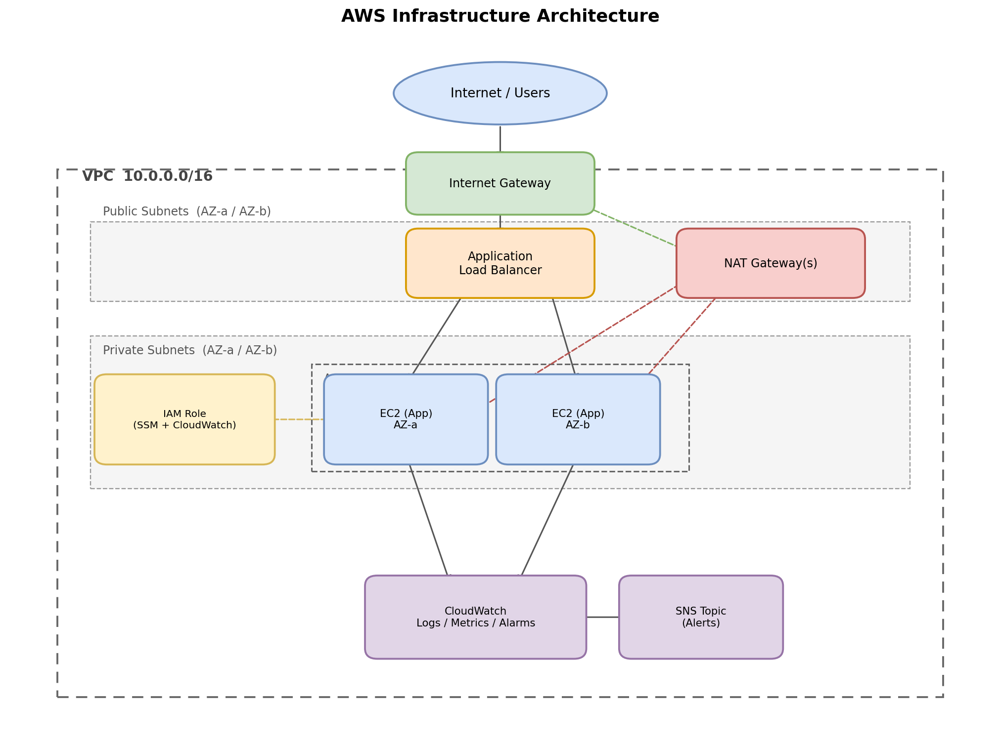

# Production-Ready AWS Infrastructure Automation using Terraform

A modular Terraform project that provisions a small but realistic
production-style AWS environment: a VPC with public/private subnets, an
Auto Scaling Group of EC2 instances behind an Application Load Balancer,
CloudWatch monitoring, and a GitHub Actions pipeline to plan and apply
changes. Built to demonstrate practical AWS, Terraform, and DevOps
fundamentals — not to include every AWS service that exists

## Overview

This project provisions the infrastructure a small web application would
actually need to run safely in AWS:

- Traffic reaches a public Application Load Balancer.
- The load balancer forwards requests to EC2 instances running in an Auto
  Scaling Group, in **private** subnets — no instance is directly reachable
  from the internet.
- Instances scale automatically based on CPU utilization.
- CloudWatch tracks the health of the whole stack and alerts via SNS.
- There is no SSH access anywhere. Administrative access, if ever needed,
  goes through AWS Systems Manager Session Manager.
- Two isolated environments (`dev`, `prod`) share the same Terraform
  modules but are sized and configured differently.

## Architecture



```
Internet
   │
   ▼
Internet Gateway
   │
   ▼
Application Load Balancer   (public subnets, 2 AZs)
   │
   ▼
Auto Scaling Group → EC2 instances   (private subnets, 2 AZs)
   │
   ├──► NAT Gateway → Internet Gateway   (outbound only: patches, SSM agent)
   └──► CloudWatch (logs, metrics, alarms) → SNS (email alerts)
```

An editable version of the diagram is in [`docs/architecture.drawio`](docs/architecture.drawio)
(open at [app.diagrams.net](https://app.diagrams.net)).

## Features

- **Modular Terraform** — networking, security, compute, and monitoring
  are separate, reusable modules with their own inputs/outputs and READMEs.
- **Environment separation** — `dev` and `prod` use the same modules with
  different `.tfvars`, so there's one codebase, not copy-pasted stacks.
- **Remote state** — state is stored in S3 (encrypted) with DynamoDB state
  locking, so applies can't collide.
- **No SSH / no static credentials** — EC2 access via SSM Session Manager;
  AWS access via IAM roles (and OIDC in CI), never long-lived access keys.
- **Auto scaling** — target-tracking scaling policy on CPU utilization.
- **CI/CD with a manual approval gate** — GitHub Actions runs
  `fmt` → `validate` → `plan` on every PR, and gates `apply` behind a
  required reviewer using GitHub Environments.
- **Monitoring** — CloudWatch alarms for high CPU, ALB 5xx errors, and
  zero healthy targets, all notifying an SNS topic.

## Folder Structure

```
aws-terraform-infra/
├── terraform/
│   ├── modules/
│   │   ├── networking/     # VPC, subnets, IGW, NAT, route tables
│   │   ├── security/       # Security Groups, IAM role/instance profile
│   │   ├── compute/        # Launch Template, ASG, ALB
│   │   └── monitoring/     # CloudWatch alarms, log group, SNS
│   └── environments/
│       ├── dev/            # backend.tf, providers.tf, main.tf, variables.tf, outputs.tf
│       └── prod/           # same structure, different sizing
├── .github/workflows/
│   └── terraform.yml       # fmt -> validate -> plan -> manual approval -> apply
├── docs/
│   ├── architecture.drawio
│   └── architecture.png
├── INTERVIEW_GUIDE.md
└── README.md
```

## Prerequisites

- [Terraform](https://developer.hashicorp.com/terraform/downloads) >= 1.6.0
- An AWS account and the [AWS CLI](https://aws.amazon.com/cli/) configured
- An S3 bucket + DynamoDB table for remote state (see below)

### One-time backend bootstrap

Terraform can't create the S3 bucket/DynamoDB table it's about to store
its own state in without a chicken-and-egg problem, so this is a one-time
manual (or scripted, outside Terraform) step:

```bash
aws s3api create-bucket \
  --bucket <your-unique-bucket-name>-terraform-state-dev \
  --region us-east-1

aws s3api put-bucket-versioning \
  --bucket <your-unique-bucket-name>-terraform-state-dev \
  --versioning-configuration Status=Enabled

aws s3api put-bucket-encryption \
  --bucket <your-unique-bucket-name>-terraform-state-dev \
  --server-side-encryption-configuration \
  '{"Rules":[{"ApplyServerSideEncryptionByDefault":{"SSEAlgorithm":"AES256"}}]}'

aws dynamodb create-table \
  --table-name terraform-locks \
  --attribute-definitions AttributeName=LockID,AttributeType=S \
  --key-schema AttributeName=LockID,KeyType=HASH \
  --billing-mode PAY_PER_REQUEST
```

Then update the `bucket` value in `terraform/environments/dev/backend.tf`
(and `prod/backend.tf`) to match.

## Deployment Steps

```bash
cd terraform/environments/dev

# Copy and adjust variables
cp terraform.tfvars.example terraform.tfvars

terraform init
terraform fmt -check
terraform validate
terraform plan
terraform apply
```

Once applied, grab the load balancer URL:

```bash
terraform output alb_dns_name
```

Open it in a browser — you should see the app's identity page showing which
instance and AZ served the request. Refresh a few times to see the ALB
spread traffic across instances.

To tear everything down:

```bash
terraform destroy
```

## Terraform Commands Reference

| Command | Purpose |
|---|---|
| `terraform fmt -recursive` | Auto-format all `.tf` files |
| `terraform init` | Download providers, configure backend |
| `terraform validate` | Check configuration syntax/internal consistency |
| `terraform plan` | Preview changes before applying |
| `terraform apply` | Apply changes |
| `terraform output` | Show output values (e.g. ALB DNS name) |
| `terraform destroy` | Tear down all managed resources |
| `terraform state list` | List resources tracked in state |

## CI/CD Pipeline

`.github/workflows/terraform.yml` implements:

1. **On pull request** — `terraform fmt -check`, `validate`, and `plan`;
   the plan output is posted as a PR comment for review.
2. **On merge to `main`** — the plan is re-run, then `apply` runs against
   the **`dev`** GitHub Environment, which requires a reviewer to approve
   before it executes.
3. **Manual dispatch** — the same pipeline can be run by hand against
   `prod`, again gated by a required reviewer on the `prod` Environment.

Authentication to AWS uses OpenID Connect (`aws-actions/configure-aws-credentials`
with `role-to-assume`), not static access keys stored as GitHub secrets.

## Security Highlights

- EC2 instances are **only** reachable from the ALB's security group —
  there is no security group rule allowing inbound traffic from `0.0.0.0/0`
  to any instance.
- **No SSH.** Access is via SSM Session Manager, which requires no open
  port, bastion host, or key pair.
- **IAM roles, not access keys**, for both EC2 instances and the CI
  pipeline (OIDC).
- **IMDSv2 enforced** on all instances (`http_tokens = "required"`).
- **Encrypted, versioned remote state** with DynamoDB locking.
- **Least-privilege IAM** — only `AmazonSSMManagedInstanceCore` and
  `CloudWatchAgentServerPolicy` are attached to the instance role.

## Screenshots

> Add screenshots here after deploying: the ALB DNS name loaded in a
> browser, the AWS Console showing the Auto Scaling Group scaling in
> response to load, and a passing GitHub Actions run.

`docs/screenshot-app.png` · `docs/screenshot-asg.png` · `docs/screenshot-pipeline.png`

## Lessons Learned

- Splitting the stack into `networking` / `security` / `compute` /
  `monitoring` modules made it much easier to reason about — and to
  explain — than one large `main.tf`.
- NAT Gateways are the most expensive piece of a small demo environment.
  Making `single_nat_gateway` a variable (one shared NAT in dev, one per
  AZ in prod) turned a cost concern into an explicit, documented design
  decision instead of something accidental.
- Enforcing "no SSH" from the start (rather than adding it and removing it
  later) forced setting up SSM Session Manager properly, which turned out
  to be simpler than managing key pairs and a bastion host.
- Getting the CloudWatch alarm dimensions right (using each resource's
  `arn_suffix` attribute rather than string-splitting an ARN) was a good
  reminder to look for what the provider already exposes before writing
  string manipulation.

## Future Improvements

- Add HTTPS via ACM + a Route 53 domain, with HTTP→HTTPS redirect
- Add WAF in front of the ALB
- Replace the CPU-based scaling policy with a request-count-based one
- Add a `terraform-compliance` or `tflint`/`checkov` step to CI
- Add a Grafana/Managed Prometheus dashboard on top of CloudWatch metrics
- Blue/green or canary deployment support via a second target group

## License

MIT — this is a personal learning/portfolio project.
